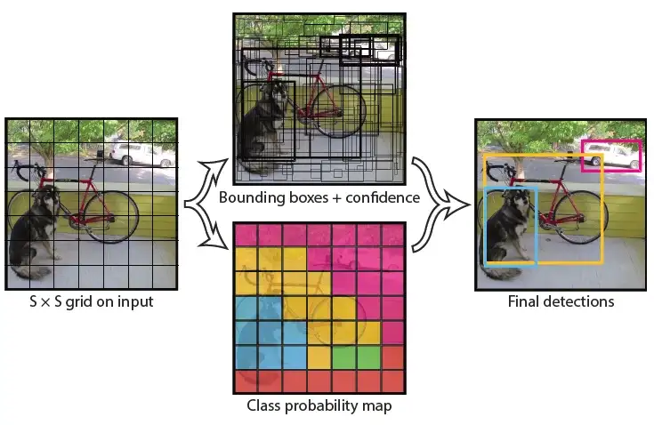

# YOLOv1: You Only Look Once object detector implementation in Pytorch

YOLO is a single stage detector published by Joseph Redmon, Santosh Divvala, Ross Girshick and Ali Farhadi in their [paper](https://arxiv.org/abs/1506.02640) in 2015.

The main idea of the paper is the fully connected head. It outputs $[S,S,C+B*5]$ tensor, where $S$ in the number of splits, $C$ the number of classes and $B$ in the number of predicted bounding boxes per cell. In fact, The image is treated as $S*S$ cells. For each cell we predict $B$ bounding boxes and apply non maximum suppression to determine the final predictions.

<div align="center">

|  | 
|:--:| 
| *YOLOv1 Single stage detection* |
</div>


The other important contribution is the loss function:


$$
\begin{gathered}
\lambda_{\text {coord}} \sum_{i=0}^{S^2} \sum_{j=0}^B \mathbb{1}_{i j}^{\text {obj }}\left[\left(x_i-\hat{x}_i\right)^2+\left(y_i-\hat{y}_i\right)^2\right] \\
+\lambda_{\text {coord }} \sum_{i=0}^{S^2} \sum_{j=0}^B \mathbb{1}_{i j}^{\text {obj }}\left[\left(\sqrt{w_i}-\sqrt{\hat{w}_i}\right)^2+\left(\sqrt{h_i}-\sqrt{\hat{h}_i}\right)^2\right] \\
+\sum_{i=0}^{S^2} \sum_{j=0}^B \mathbb{1}_{i j}^{\text {obj }}\left(C_i-\hat{C}_i\right)^2 \\
+\lambda_{\text {noobj }} \sum_{i=0}^{S^2} \sum_{j=0}^B \mathbb{1}_{i j}^{\text {noobj }}\left(C_i-\hat{C}_i\right)^2 \\
+\sum_{i=0}^{S^2} \mathbb{1}_i^{\mathrm{obj}} \sum_{c \in \text { classes }}\left(p_i(c)-\hat{p}_i(c)\right)^2
\end{gathered}
$$

The first and second term compute loss over the coordinates of the bounding boxes. The sums are over the number of cells and predicted bounding boxes per cell. However only the terms where the cell has a true bounding box and the most confidante bounding box prediction.  
The third and the fourth term computer loss over predicted class. The former is for cells with objects and latter without objects.  
The last term focus on the probabilities of bounding boxes. The truth probability is set to the iou with most probable iou of the cell.  

## Installation

Requirements are available in `requirements.txt``. Create a virtual environnement then install them:
`pip install -r requirements.txt`

The dataset can be found in [kaggle](https://www.kaggle.com/dataset/734b7bcb7ef13a045cbdd007a3c19874c2586ed0b02b4afc86126e89d00af8d2)

## Training

To train the model you can run 

```
python train.py
```

Training params are in `train.py`

```    
params = {
    "lr": 1e-3,
    "batch_size": 16,
    "weight_decay": 5e-4,
    "momentum": 0.9,
    "epochs": 90,
    "num_workers": 8,
    "pin_memory": True,
    "img_dir": Path("../../../data/voc/images"),
    "label_dir": Path("../../../data/voc/labels"),
    "training_csv": Path("../../../data/voc/train.csv"),
    "test_csv": Path("../../../data/voc/test.csv"),
    "num_epochs_between_checkpoints": 5,
    "num_epochs_between_tests": 1,
    "test": True
}
```

## Notes:
In paper, the model's backbone is trained on ImageNet dataset first than trained on Pascal-VOC 2007 and 2012. In this implementation, we only use Pascal-VOC without features pre-training.


